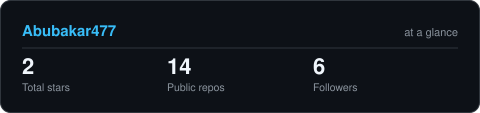

<!-- BANNER - terminal profile.sh --live -->
<picture>
  <source media="(prefers-color-scheme: dark)"  srcset="assets/banner-dark.v9.svg?v=10">
  <source media="(prefers-color-scheme: light)" srcset="assets/banner-light.v9.svg?v=10">
  
</picture>

 

<!-- NAME / TAGLINE - animated typing -->

 

<!-- SOCIALS & BADGES -->
&nbsp;&nbsp;
&nbsp;&nbsp;

 

---

## This is me :)

Hi, I'm **Abubakar**, a Computer Science student at IST and an aspiring Software Developer based in Islamabad, Pakistan 🇵🇰.
I'm passionate about building impactful software, crafting modern interactive web experiences, and exploring innovative programming solutions with clean graphic design.

- 🎓 **BS Computer Science at [Institute of Space Technology (IST)](https://ist.edu.pk/)**: developing deep foundations in algorithms, data structures, and computer systems.
- 💻 **Software & Web Development**: focused on creating responsive, performant web applications using modern JavaScript/TypeScript and Python ecosystems.
- 🎨 **Graphic Design & Creative UI/UX**: bridging software engineering with aesthetic visual identity and user-centric design.
- 🚀 **Interactive 3D Portfolio**: Check out my work live at **[my-3d-portfolio-snowy-eight.vercel.app](https://my-3d-portfolio-snowy-eight.vercel.app/)**.
- 🌱 **Growth Mindset**: continuously honing problem-solving skills, building personal projects, and learning cutting-edge developer tooling.
- 📬 **Get In Touch**: open to collaborations and opportunities. Feel free to connect via **[abubakar2pp@gmail.com](mailto:abubakar2pp@gmail.com)**!

 

## my perfect stack`

---

## signals

<table>
<tr>
<td width="50%" align="center" valign="middle">

<!-- Self-rated skill radar - edit assets/skills.json, the workflow redraws it -->
<picture>
  <source media="(prefers-color-scheme: dark)"  srcset="assets/radar-dark.svg">
  <source media="(prefers-color-scheme: light)" srcset="assets/radar-light.svg">
  
</picture>

</td>
<td width="50%" align="center" valign="middle">

<!-- Language & stack radar - edit assets/langmix.json, the workflow redraws it -->
<picture>
  <source media="(prefers-color-scheme: dark)"  srcset="assets/radar-langs-dark.svg">
  <source media="(prefers-color-scheme: light)" srcset="assets/radar-langs-light.svg">
  
</picture>

</td>
</tr>
</table>

---

## Numbers matter? ohhh yes.

<!-- Generated by scripts/cards.py into this repo. Deliberately NOT
     github-readme-stats / streak-stats / github-profile-trophy: those are
     shared public instances that go down and take the whole section with them. -->
<picture>
  <source media="(prefers-color-scheme: dark)"  srcset="assets/card-stats-dark.svg">
  <source media="(prefers-color-scheme: light)" srcset="assets/card-stats-light.svg">
  
</picture>

 

---

` Built with ❤️ by Abubakar · Islamabad, Pakistan `

